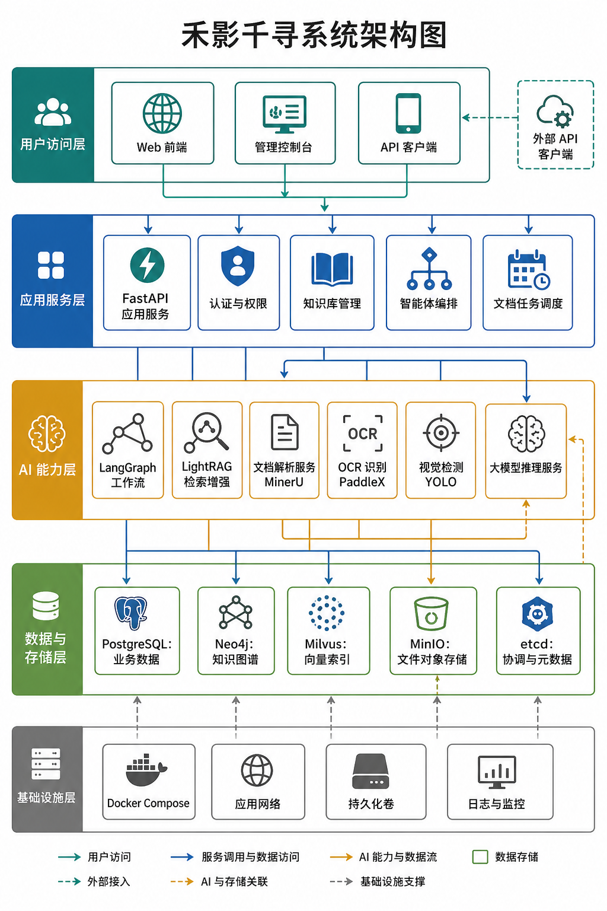

# 禾影千寻 (QianXun)

基于大模型、知识图谱与视觉识别的智能分析平台，融合 RAG、知识图谱、YOLO 图像识别、Agent 推理与作物管理能力，技术栈为 LangGraph v1 + Vue.js + FastAPI + LightRAG。


## 系统架构



## 项目简介

禾影千寻（QianXun）是一个面向企业级知识管理与智能分析场景的全栈平台，提供从**文档接入 → 知识检索 → 图谱构建 → 图像识别 → 推理决策**的一体化能力。主要包含以下核心领域：

- **知识库与 RAG**：文档解析、向量化存储、语义检索与智能问答
- **知识图谱**：基于 Neo4j 的实体-关系图谱构建与查询
- **视觉识别**：基于 YOLO 的目标检测与图像分析能力
- **智能体编排**：基于 LangGraph 的多步骤 Agent 工作流，支持工具调用
- **作物管理**：配套 Java Spring Boot 农资服务后端，支撑农业场景业务

项目完全通过 Docker Compose 编排，开发环境默认开启前后端热重载，适合本地联调与二次开发。

> 禾影千寻基于开源社区优秀项目[语析 (Yuxi)](https://github.com/xerrors/Yuxi) 进行深度二次开发，并严格遵循其 MIT 开源许可证。感谢 Yuxi 项目的卓越贡献。

## 核心能力

- **文档知识库**：支持文档导入、解析、切分、向量化与语义检索
- **知识图谱**：基于 Neo4j 存储实体与关系，支持图谱查询增强问答
- **智能问答**：结合 RAG、图谱、外部搜索（Tavily）与工具调用，生成高质量回答
- **YOLO 目标识别**：对上传图片进行目标检测，返回类别、置信度与标注结果图
- **思考模式**：支持对兼容模型开启思考模式（low / medium / high / xhigh），增强复杂推理能力
- **智能体编排**：基于 LangGraph 构建多步骤 Agent 工作流，支持知识库、图谱、搜索、天气、YOLO 等工具协同
- **多模型接入**：支持 SiliconFlow、DeepSeek、OpenAI、ZhipuAI、DashScope 等多种模型供应商
- **文档解析（MinerU）**：集成 MinerU 实现高精度文档内容提取与版面分析
- **OCR 文字识别（PaddleX）**：集成 PaddleX 提供光学字符识别能力
- **外部工具集成**：高德地图、彩云天气、微信公众号、邮件通知等
- **私有化部署**：全部服务由 Docker Compose 编排，适合内网或本地部署

## 技术栈

| 分类 | 技术 |
|------|------|
| 前端 | Vue.js + Ant Design Vue + ECharts + G6 (图可视化) |
| 后端 | FastAPI (Python) + Spring Boot (Java, 作物管理) |
| Agent 编排 | LangGraph v1 |
| RAG | LightRAG |
| 图数据库 | Neo4j (5.26) |
| 向量数据库 | Milvus (2.5.6) |
| 关系数据库 | PostgreSQL 16 |
| 对象存储 | MinIO |
| 文档解析 | MinerU (vLLM 加速) |
| OCR | PaddleX |
| 视觉识别 | YOLO |
| 包管理 | Python: uv / Node: pnpm |

## 主要功能

### 知识库问答

- 支持接入文档型知识库，覆盖常见办公文档格式
- 集成 MinerU 进行高精度文档解析与版面分析
- 文档自动切分、向量化存储与语义检索
- 可结合外部搜索、知识图谱与工具调用生成回答

### 知识图谱分析

- 基于 Neo4j 的实体与关系存储
- 图谱查询结果作为上下文增强问答能力
- 支持知识关联分析与辅助决策
- 前端基于 G6 进行图数据可视化展示

### YOLO 图像识别

平台内置独立的 `yoloapi` 服务，支持对图片执行目标检测。识别流程：

1. 从 MinIO 对象存储读取图片
2. 使用 YOLO 模型执行检测
3. 返回识别类别、置信度和边界框坐标
4. 自动生成带标注框的结果图片并回传链接

适用于病害识别、目标检测、现场巡检、样本识别等场景。

### 思考模式

智能体支持为兼容模型开启思考模式，并可配置思考强度：

- `low` — 轻度思考
- `medium` — 中等思考
- `high` — 深度思考
- `xhigh` — 极致思考

适用于多步骤推理、工具调用、复杂问答和长链路分析任务。不兼容的模型不会强制启用。

### Agent 工作流

- 基于 LangGraph 构建多步骤 Agent
- 支持工具调用：知识库检索 / 图谱查询 / 网页搜索 / 天气查询 / YOLO 识别 / 计算器
- 支持附件处理与上下文持久化
- 支持多模型供应商切换

### 作物管理

- 配套 Java Spring Boot 农资管理后端（`qianxun-server`）
- 提供作物档案、农事记录等业务数据管理能力
- 与 AI 引擎联动，提供数据驱动的农业决策支持

## 目录结构

```text
.
├─server/                  # FastAPI 入口与服务端代码
│  ├─main.py               # FastAPI 应用入口
│  ├─routers/              # API 路由
│  └─utils/                # 工具函数
├─src/                     # Python 核心业务模块
│  ├─agents/               # LangGraph Agent 定义
│  ├─config/               # 配置管理
│  ├─knowledge/            # 知识库相关逻辑
│  ├─models/               # 数据模型
│  ├─plugins/              # 插件系统
│  ├─repositories/         # 数据访问层
│  ├─services/             # 业务服务层
│  ├─storage/              # 存储抽象层
│  └─utils/                # 工具函数
├─web/                     # Vue 前端
│  └─src/
│      ├─apis/             # API 接口定义
│      ├─components/       # 通用组件
│      ├─composables/      # 组合式函数
│      ├─layouts/          # 布局组件
│      ├─router/           # 路由配置
│      ├─stores/           # 状态管理
│      └─views/            # 页面视图
├─docs/                    # VitePress 文档
├─docker/                  # Dockerfile 与服务配置
├─crop-management-system/  # 农资管理 Spring Boot 后端
├─models/                  # 本地模型（挂载到容器）
├─saves/                   # 上传文件与运行数据
├─scripts/                 # 辅助脚本
└─test/                    # 测试代码
```

## 快速开始

### 1. 环境准备

确保本机已安装：

- Docker & Docker Compose
- Make（可选，用于快捷命令）

### 2. 初始化配置

复制环境变量模板并按需填写：

```bash
cp .env.template .env
```

至少建议检查以下配置：

| 配置项 | 说明 |
|--------|------|
| `SILICONFLOW_API_KEY` | 模型服务 API Key（推荐） |
| `TAVILY_API_KEY` | 联网搜索 API Key |
| `YUXI_SUPER_ADMIN_NAME` | 超级管理员用户名 |
| `YUXI_SUPER_ADMIN_PASSWORD` | 超级管理员密码 |
| `MODEL_DIR` | 本地模型目录路径 |
| `SAVE_DIR` | 数据保存目录路径 |

### 3. 启动开发环境

```bash
make start
# 或
docker compose up -d
```

首次启动会自动构建镜像，请耐心等待。

### 4. 访问服务

| 服务 | 地址 |
|------|------|
| 前端界面 | http://localhost:5173 |
| 后端 API | http://localhost:5050 |
| API 文档 | http://localhost:5050/docs (Swagger) |
| Neo4j 管理 | http://localhost:7474 |
| MinIO 管理 | http://localhost:9001 |
| YOLO API | http://localhost:8001 |

## 开发方式

本项目推荐直接在运行中的容器内调试。代码改动后不需手动重启，`api-dev` 和 `web-dev` 服务会自动热更新。

### 常用命令

```bash
# 查看运行状态
docker ps

# 查看后端日志
docker logs qianxun-api-dev --tail 100

# 进入后端容器
docker compose exec api bash

# Python 代码规范检查与格式化
make lint
make format

# 在容器中运行测试
docker compose exec api uv run python test/your_script.py

# 停止所有服务
make stop
```

后端接口调试可使用 `.env` 中配置的 `YUXI_SUPER_ADMIN_NAME` / `YUXI_SUPER_ADMIN_PASSWORD`。

### 代码规范

- Python 代码遵循 Pythonic 风格，兼容 Python 3.12+
- Vue 样式使用 Less，优先使用 `base.css` 中的颜色变量
- UI 风格保持简洁一致，避免悬停位移、过度阴影与渐变
- API 接口定义统一放在 `web/src/apis/` 下

## 服务矩阵

| 服务 | 说明 | 端口 | 默认启用 |
|------|------|------|----------|
| `api` | FastAPI 后端 | `5050` | ✅ |
| `web` | Vue 前端 | `5173` | ✅ |
| `postgres` | PostgreSQL 16 数据库 | `5432` | ✅ |
| `graph` | Neo4j 图数据库 | `7474`/`7687` | ✅ |
| `milvus` | 向量数据库 (2.5.6) | `19530` | ✅ |
| `etcd` | Milvus 依赖 (etcd) | — | ✅ |
| `minio` | 对象存储 | `9000`/`9001` | ✅ |
| `yoloapi` | YOLO 目标检测 | `8001` | ✅ |
| `qianxun-server` | 农资管理 Spring Boot 后端 | `8082` | ✅ |
| `mineru-vllm-server` | MinerU 文档解析 (vLLM) | `30000` | ⚡ profile: all |
| `mineru-api` | MinerU API 服务 | `30001` | ⚡ profile: all |
| `paddlex` | PaddleX OCR 识别 | `8080` | ⚡ profile: all |

> `mineru-vllm-server`、`mineru-api`、`paddlex` 等 GPU 密集型服务通过 Docker Compose profile 管理，在需要文档解析或 OCR 功能时启用：
> ```bash
> docker compose --profile all up -d
> ```

## 外部集成

| 集成 | 用途 | 配置项 |
|------|------|--------|
| SiliconFlow / DeepSeek / OpenAI 等 | LLM 模型服务 | `SILICONFLOW_API_KEY` 等 |
| Tavily | 联网搜索 | `TAVILY_API_KEY` |
| 高德地图 | 地理位置服务 | `AMAP_KEY` |
| 彩云天气 | 实时天气查询 | `CAIYUN_TOKEN` |
| 微信公众号 | 公众号消息接入 | `WECHAT_*` |
| 邮件 (SMTP) | 邮件通知 | `SMTP_*` |
