# 禾影千寻使用说明书

## 一、首页


禾影千寻是一款面向智慧农业领域打造的 AI 智能分析平台，整体采用简洁现代的绿色科技风设计，围绕"大模型 + 知识图谱 + 视觉识别"三大核心技术展开。平台致力于为农业场景提供智能化分析、知识问答与病虫害识别等服务，助力智慧农业数字化建设。

首页采用模块化布局设计，主要包含"主页、Agent、图谱、博客"四个功能页面入口，通过图文结合的方式展示平台核心能力与应用场景。页面整体结构清晰，视觉风格统一，能够直观体现平台的技术特点与产品定位。

### 平台核心功能

- **Agent 智能体编排**
  基于大模型与 LangGraph 工作流，实现多步骤推理、工具调用与智能任务协同处理，提高复杂农业问题的分析效率。平台内置多种专用 Agent，涵盖通用问答、深度调查、病虫害识别等场景。

- **YOLO 病虫害目标检测**
  利用计算机视觉与 YOLO 目标检测技术，对农作物病虫害进行识别与定位，辅助农业生产监测与管理。用户上传作物图片后，系统自动检测并标注病虫害区域，返回识别结果与置信度。

- **结构化知识图谱**
  通过知识图谱技术（Neo4j + LightRAG）构建农业领域实体关系网络，实现农业知识关联分析与智能检索，提升知识管理能力。支持可视化的图谱交互与节点详情查看。

- **AI 智能问诊**
  结合农业知识库与大模型能力，为用户提供智能问答、病害诊断及农业种植建议等服务。支持上传图片进行病虫害识别，结合天气数据与知识库给出综合防治方案。

- **智能分析报告**
  系统能够自动生成结构化分析报告，对识别结果与农业数据进行总结与分析，辅助用户进行科学决策。支持导出 PDF 格式报告。

此外，平台还提供博客模块，用于展示农业 AI 相关文章、技术分享与平台动态，增强系统的信息展示与内容扩展能力。


## 二、登录注册

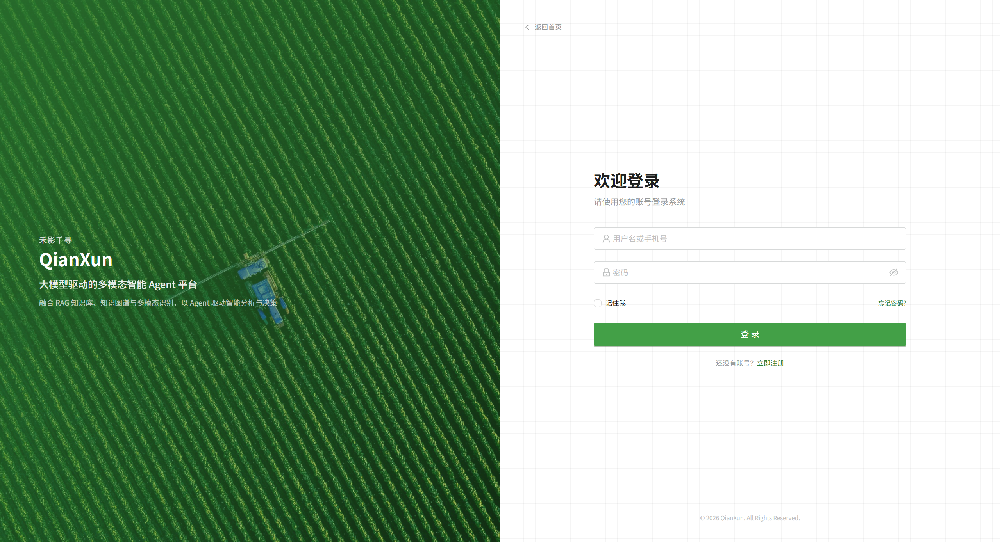
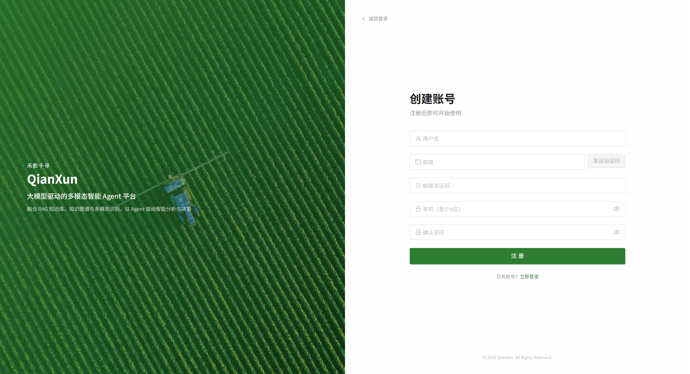

### 登录
- 首次运行系统时，会进入初始化页面，需要创建超级管理员账号
- 正常登录使用用户名或手机号 + 密码
- 支持"记住我"功能
- 连续 5 次登录失败将锁定账号 30 分钟，页面会显示倒计时
- 登录成功后根据角色跳转：管理员进入 Agent 管理页，普通用户进入默认 Agent

### 注册
- 使用邮箱注册，需要先获取邮箱验证码（60 秒冷却时间）
- 用户名支持中文、字母、数字，长度 2-20 位
- 密码长度 6 位以上


## 三、AI 对话

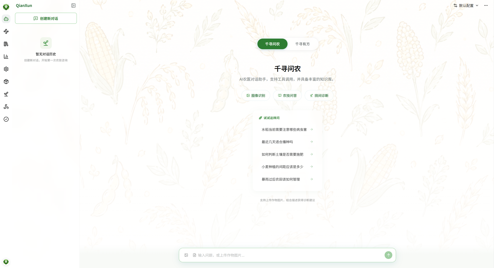

平台提供两种对话方式：**千寻问农** 和 **千寻有方**。

### 千寻问农（通用问答 Agent）

千寻问农是通用聊天 Agent，具备以下能力：

| 功能 | 说明 |
|------|------|
| 病害识别 | 上传作物图片，自动调用 YOLO 目标检测进行病虫害识别 |
| 药品查询 | 查询农业药品信息，用法用量、注意事项等 |
| 天气查询 | 根据用户所在地查询实时天气与预报 |
| 知识库检索 | 基于 RAG 技术检索农业知识库 |
| 联网搜索 | 通过 Tavily 搜索引擎获取最新网络信息 |
| 知识图谱查询 | 查询 Neo4j 知识图谱中的实体关系 |
| 计算器 | 数学表达式求值 |
| 图像生成 | AI 生成农业相关图片 |
| 附近用户 | 根据地理位置查找附近农户 |

**病害识别流程**：用户上传作物图片 → 自动调用 YOLO 目标检测 → 识别病虫害并标注图片（含置信度） → 查询当地天气 → 检索知识库获取病症与解决方案 → 返回包含病症、防治措施、推荐用药的综合报告。推荐用药会根据当前季节和天气情况给出具体指导。

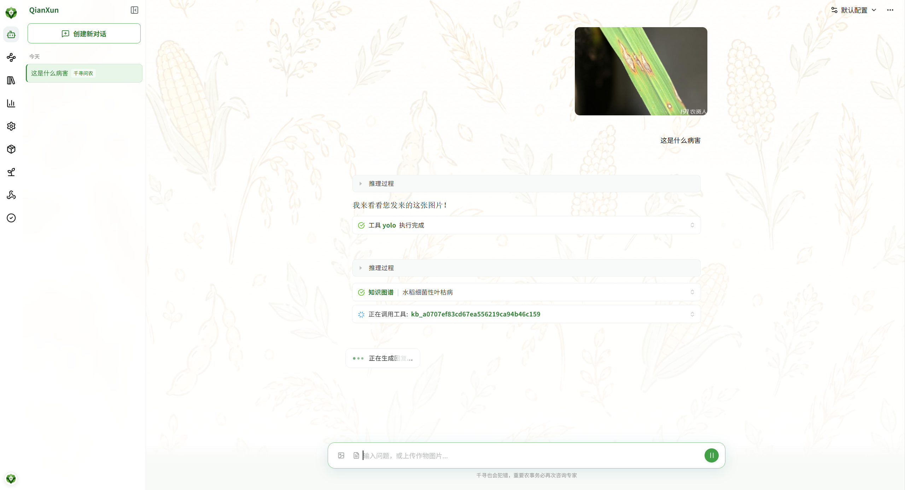

### 千寻有方（深度调查 Agent）

千寻有方是深度调查 Agent，能够自主制定调查计划，创建子 Agent 进行多维度调查，最终生成完整的分析报告。适用于需要深度分析的复杂农业问题。

### Agent 配置

管理员可为每个 Agent 配置以下参数：

- **模型选择**：选择底层的对话模型
- **系统提示词**：定义 Agent 的行为与人格
- **工具配置**：启用/禁用工具列表（如病害识别、天气查询、知识库等）
- **知识库关联**：绑定需要检索的知识库
- **配置模板**：可创建多个配置模板，在不同场景间快速切换，支持设置默认模板

### 对话管理

- 支持多轮对话，自动保存对话历史
- 可创建多个对话线程，支持切换、重命名、删除
- 消息支持点赞/点踩反馈
- 支持流式输出（SSE），实时显示回复内容
- 附件上传：支持图片、文件等多种格式
- 对话可导出为 HTML 文件


## 四、公众号绑定

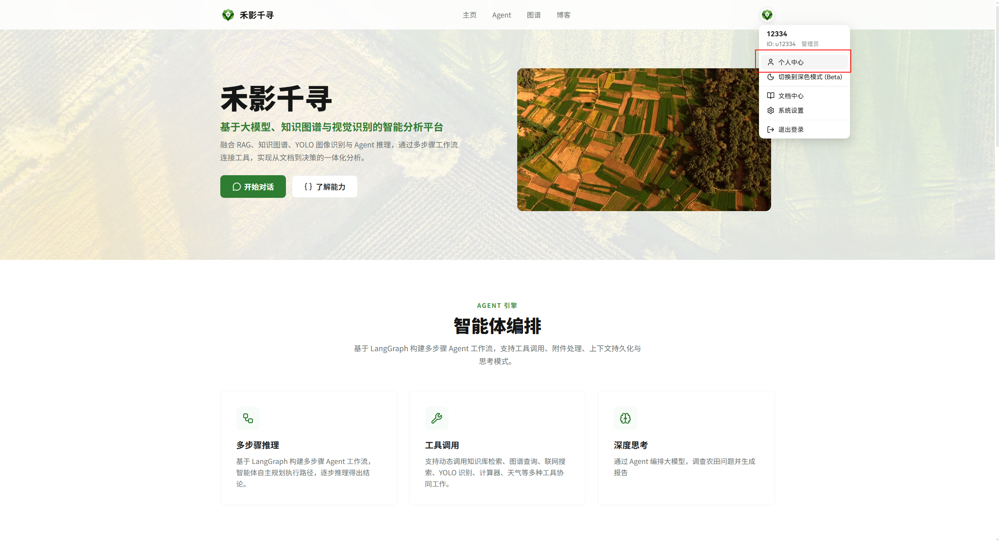
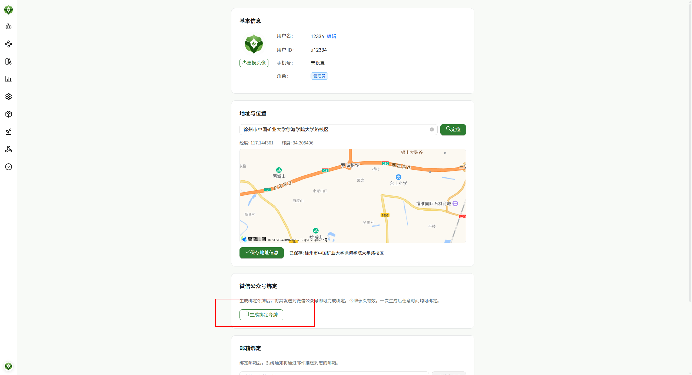
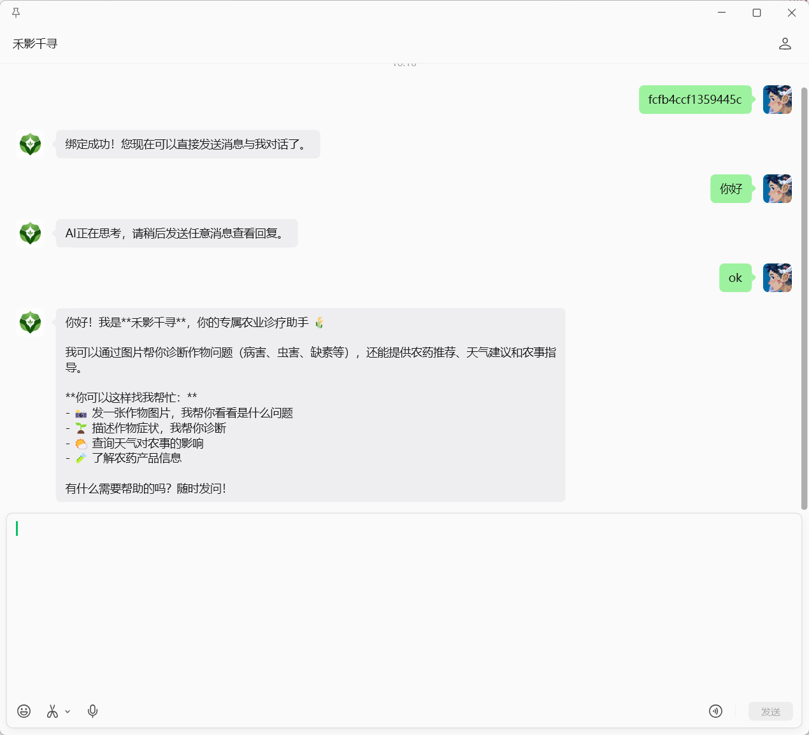

平台支持微信公众号绑定，绑定后可通过微信接收平台推送的消息。

**绑定步骤**：
1. 在个人中心点击"绑定公众号"
2. 系统生成一个一次性绑定令牌（有效期为 15 天）
3. 关注禾影千寻公众号
4. 在公众号发送绑定令牌完成绑定

可在个人中心查看绑定状态和解绑。绑定后，平台推送的消息会同步发送到微信。


## 五、知识图谱

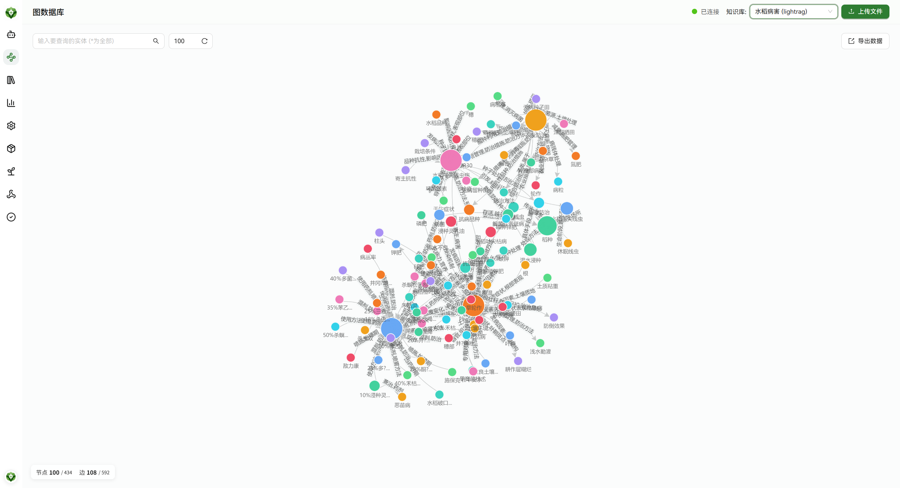

知识图谱模块基于 Neo4j 图数据库构建，展示农业领域实体之间的关联关系。

**功能说明**：
- 右上角可选择要展示的知识库（支持 Neo4j 和 LightRAG 两种图谱类型）
- 图谱连接状态指示：绿色=已连接，灰色=未连接，闪烁=加载中
- 节点交互：点击选中节点显示详情信息，拖动调整图谱布局
- 边交互：点击连线查看实体关系详情
- 搜索功能：按名称搜索实体节点（输入 `*` 查看全部节点）
- 采样控制：可调节加载的节点数量
- 数据导出：支持将图谱数据导出为 JSON 文件

**管理员功能**：
- 导入实体：上传 JSONL 文件向图库添加实体
- 索引节点：为未索引的 Neo4j 节点添加嵌入向量


## 六、知识库管理

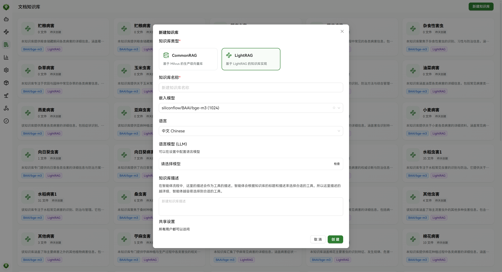

### 知识库类型

平台支持多种知识库后端：

| 类型 | 特点 | 适用场景 |
|------|------|----------|
| **LightRAG** | 基于知识图谱的 RAG，能构建实体关系网络，支持图谱展示 | 复杂知识关联分析 |
| **Milvus** | 向量数据库，高性能相似度检索 | 大规模文档检索 |
| **FAISS** | 本地向量索引，轻量高效 | 中小规模本地部署 |
| **Qdrant** | 向量搜索引擎 | 高性能检索场景 |

推荐使用 **LightRAG**，它不仅能进行语义检索，还能自动构建实体关系图谱，实现知识间的关联分析。纯向量数据库无法直接构建图谱，展示效果不如 LightRAG 直观。

### 创建知识库
- 选择知识库类型，填写名称和描述
- 选择嵌入模型（Embedding Model）
- LightRAG 类型还需选择语言和 LLM 模型
- 配置共享权限（指定可访问的用户）

### 知识库详情


进入知识库后可进行以下操作：

**文件管理**：
- 上传文件：支持 PDF、Word、Excel、PPT、TXT、Markdown、HTML、JSON、CSV、图片等多种格式
- URL 内容抓取：从指定 URL 获取内容入库
- 文件夹上传：支持 zip 压缩包批量上传
- 文件夹分类管理：创建文件夹组织文件
- 文件在线预览：查看解析后的文档内容
- 批量解析和索引：一键处理待处理的文件

**知识图谱**（LightRAG 类型）：
- 可视化展示知识库中实体的关系网络
- 支持交互式浏览和搜索

**检索测试**：
- 输入查询语句测试检索效果
- 自动生成示例问题
- 调整检索参数（rerank、top_k 等）

**思维导图**：
- AI 自动从知识库文件生成知识思维导图
- 基于 Markmap 渲染，支持交互式展开/折叠

**RAG 评估**（Milvus 类型）：
- 上传或自动生成评测基准数据集
- 运行 RAG 评估并查看详细指标
- 查看评测历史记录

### 文件处理流程

上传的文件需要经过两个阶段才能被 Agent 检索到：

1. **解析（Parse）**：将原始文件转换为 Markdown 格式文本。不同类型文件使用不同的解析引擎：
   - Office 文件（docx/xlsx/pptx）：使用 Docling 转换为 Markdown，并提取嵌入图片上传至 MinIO
   - PDF/图片：可使用 OCR 引擎解析（详见下文）
   - 纯文本/Markdown：直接读取
   - HTML：通过 BeautifulSoup + markdownify 转换
   - CSV/Excel：按行转换为 Markdown 表格
   - JSON：格式化为 Markdown 代码块

2. **索引（Index）**：将解析后的文本向量化，存入向量数据库，使 Agent 能够检索

### 知识库导出

支持导出为 CSV、XLSX、Markdown、TXT 等格式。

### OCR 文档解析引擎

平台支持多种 OCR 引擎用于 PDF 和图片的文本提取：

| OCR 引擎 | 类型 | 特点 |
|----------|------|------|
| **RapidOCR (ONNX)** | 本地离线 | 基于 PP-OCRv4 模型，无需外部服务，纯 CPU 可运行 |
| **MinerU** | 本地服务 | 基于视觉语言模型的高精度解析，支持版面分析、表格和公式识别（需 GPU） |
| **MinerU 官方** | 云端 API | MinerU.net SaaS 服务，通过 API Key 调用 |
| **PaddleX (PP-StructureV3)** | 本地服务 | 版面分析引擎，支持表格和公式识别（需 GPU） |
| **DeepSeek OCR** | 云端 API | 通过 SiliconFlow 调用 DeepSeek-OCR 视觉语言模型 |

可在系统设置中配置默认 OCR 引擎，也可以在文件上传时指定使用的引擎。


## 七、农业资产管理

### 分类管理
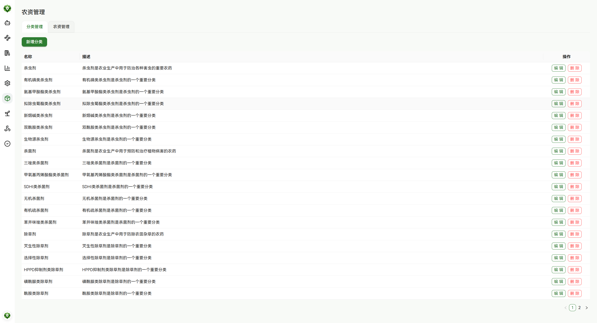

管理农资分类（如农药、肥料、种子等），支持添加分类名称和描述。

### 农资管理
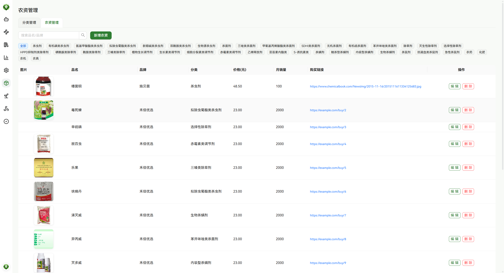

对具体的农资产品进行增删改查管理。

**农资信息字段**：
- 产品名称、品牌、所属分类
- 价格（元）、月销量
- 产品主图上传
- 登记证号、剂型、含量规格
- 适用作物、使用方法、注意事项
- 产品描述、购买链接

**注意**：农资管理功能需要独立的 Spring Boot 后端（`qianxun-server`，端口 8082）支持。


## 八、农作物字典管理

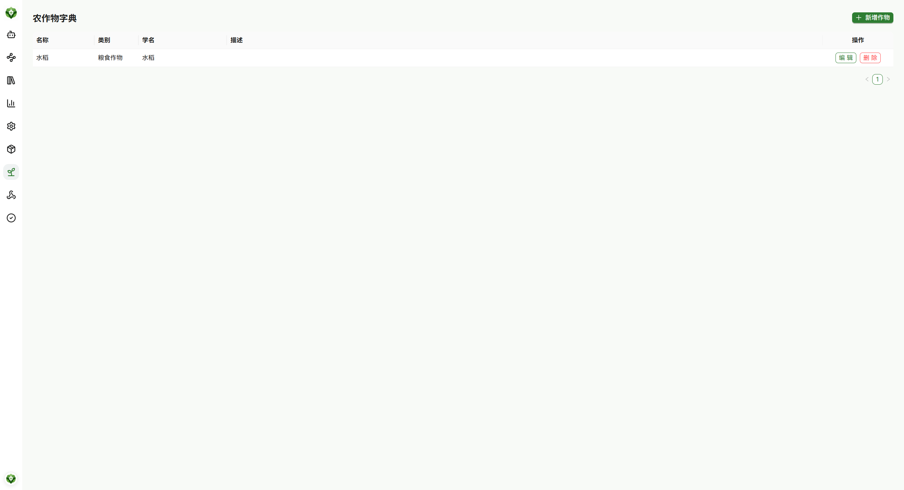

对农作物字典进行增删改查管理。

**字段**：名称、学名、分类、描述

**分类选项**：粮食作物、经济作物、蔬菜、果树、花卉、其他


## 九、Webhook 推送管理

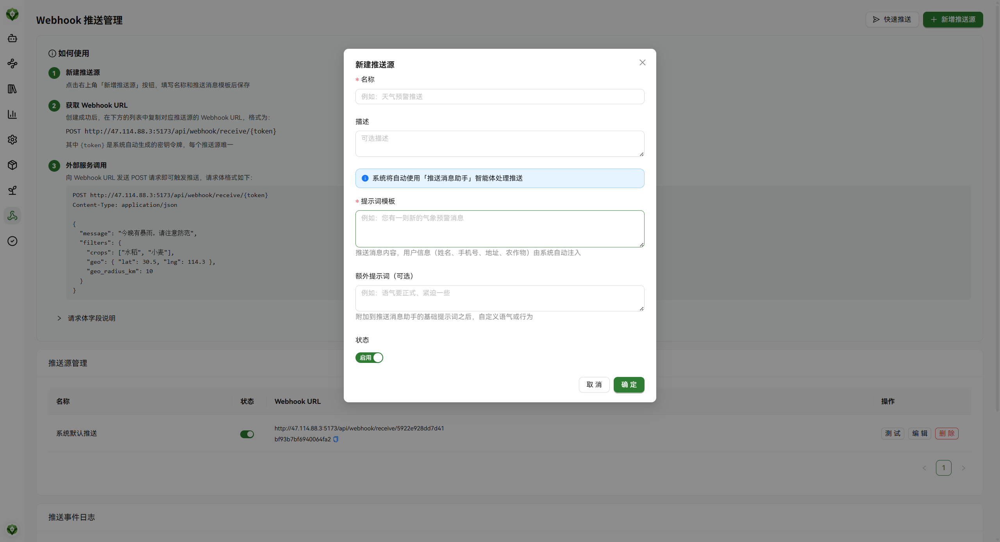

平台提供 Webhook 推送功能，支持外部系统通过 API 向用户推送消息。

### 推送源管理
- 创建推送源：填写名称、提示词（控制消息生成风格）
- 创建成功后系统自动生成唯一推送 Token
- 支持启用/停用推送源

### 推送方式

**外部推送**：
外部系统通过 `POST /api/webhook/receive/{token}` 发送请求，请求体中的消息会经过 Agent（推送消息助手）处理后推送给用户。

**快速推送（内部）**：
管理员可直接通过管理界面发送消息，无需外部调用，支持：
- 选择推送源
- 填写消息内容
- 设置推送过滤条件（作物类型、地理位置经纬度与半径等）
- 实时查看推送结果

### 推送渠道
- **平台对话**：推送到用户最近的 Agent 对话中
- **QQ 邮箱**：发送到用户绑定的 QQ 邮箱

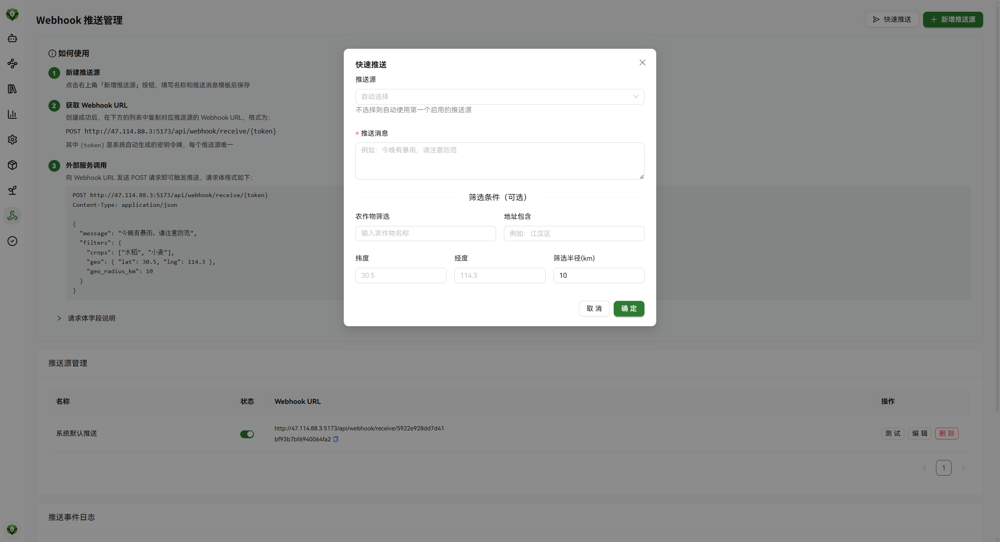
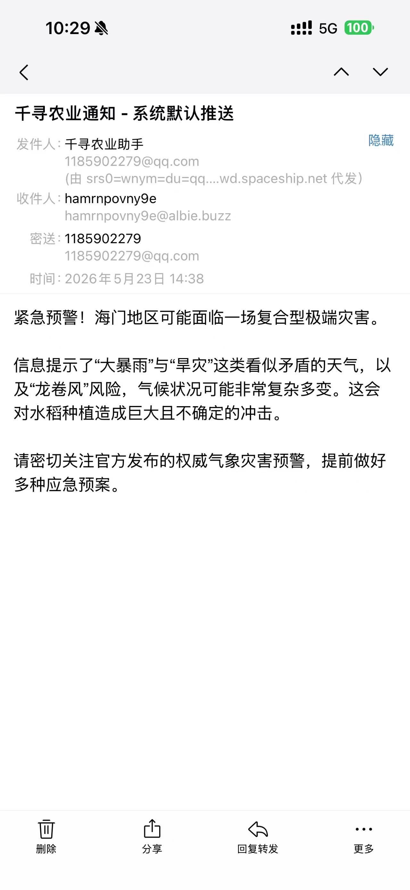


## 十、Dashboard 数据面板

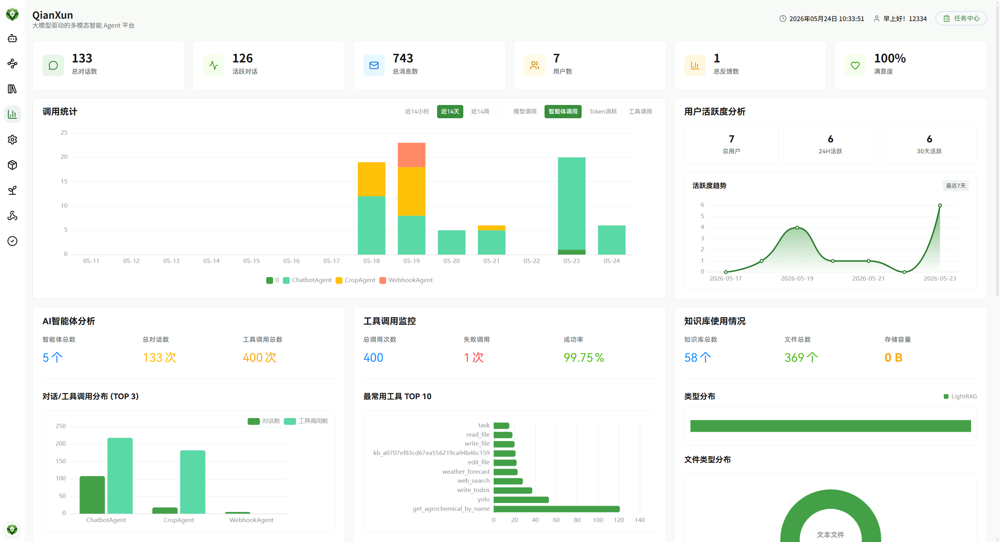

数据面板为管理员提供全面的系统运行数据可视化展示。

**统计模块**：
- **概览卡片**：总对话数、消息数、用户数、反馈数
- **用户统计**：总用户数、24 小时活跃、30 日活跃、7 日每日活跃趋势
- **工具调用统计**：调用总数、成功率/失败率、最常使用工具排行、每日调用趋势
- **知识库统计**：数据库数、文件数、存储量、类型分布
- **Agent 统计**：各 Agent 对话量、满意度评分、效果排行
- **调用时序**：14 小时/14 天/14 周的调用趋势（分模型、Agent、Token、工具四个维度）

**对话列表**：
可按用户、状态等条件筛选查看所有用户的对话记录，点击可查看对话详情与消息内容。

**用户反馈**：
查看所有用户的消息反馈（好评/差评），可按评分和 Agent 筛选。


## 十一、个人中心

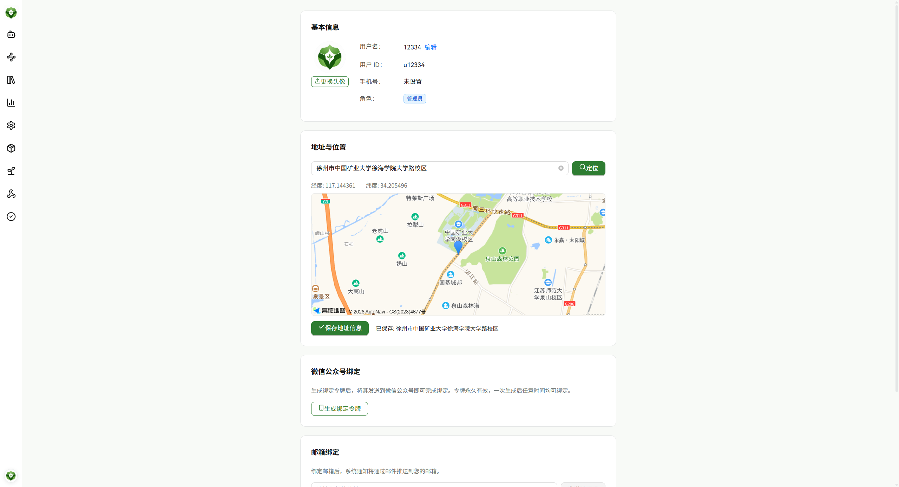

个人中心为已登录用户提供个人资料管理和配置功能。

**功能模块**：

| 模块 | 功能 |
|------|------|
| 基本信息 | 修改头像（5MB 以内）、用户名、手机号 |
| 地址与位置 | 设置住址地址，通过高德地图 API 进行地理编码，拖拽地图标记定位，自动保存经纬度 |
| 我的农作物 | 添加/删除种植的农作物，设置种植面积、昵称、种植日期 |
| 微信绑定 | 生成绑定令牌 / 绑定 / 解绑微信公众号 |
| 邮箱绑定 | 发送验证码 / 验证绑定 / 解绑邮箱，用于接收通知 |

**附近农户**：系统会根据用户设置的地理位置，通过 geohash 算法查找附近的农户。


## 十二、系统设置（后台管理）

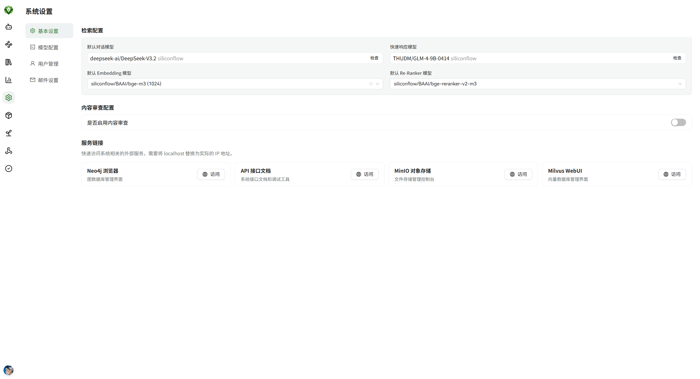

系统设置分为四个功能标签页，不同角色可见范围不同：

### 1. 基础设置（仅超级管理员）

- **对话模型**：选择默认的聊天模型
- **快速模型**：选择快速响应模型
- **嵌入模型**：选择文本嵌入模型
- **Reranker 模型**：选择重排序模型
- **内容审查**：启用/禁用 LLM 内容审查，配置审查模型

### 2. 模型配置（仅超级管理员）

- **自定义提供商**：添加和管理自定义 LLM 提供商（ID、名称、地址、API Key、默认模型、可用模型列表）
- **连接测试**：测试提供商连接是否正常
- **内置提供商**：查看内置 LLM 提供商（百炼、DeepSeek、豆包、ModelScope、OpenAI、OpenRouter、SiliconCloud、Together、智谱等）

### 3. 用户管理（管理员以上）

- **创建用户**：自动生成用户 ID，设置角色（超级管理员/管理员/普通用户）、密码、邮箱
- **编辑用户**：修改用户名、手机号、角色
- **删除用户**：软删除（匿名化处理并释放手机号）
- **用户名验证**：实时检测用户名可用性

### 4. 邮箱设置（仅超级管理员）

- 配置 SMTP 服务器（主机、端口、用户名、密码、发件人名称、发件人地址）
- 测试邮件发送


## 十三、任务中心

任务中心是一个全局侧边栏抽屉，记录系统中所有后台任务的执行状态。

**支持的任务类型**：
- 知识库文件解析（knowledge_parse）
- 知识库文件索引（knowledge_index）
- 知识库文件导入（knowledge_ingest）
- Webhook 消息处理（webhook_process）

**功能**：
- 查看任务列表（全部/进行中/失败/成功）
- 任务进度条显示
- 取消进行中的任务
- 删除已完成的任务记录
- 右上角徽章显示当前进行中的任务数


## 十四、博客

博客模块面向所有访客开放，用于展示农业 AI 相关的技术文章和平台动态。
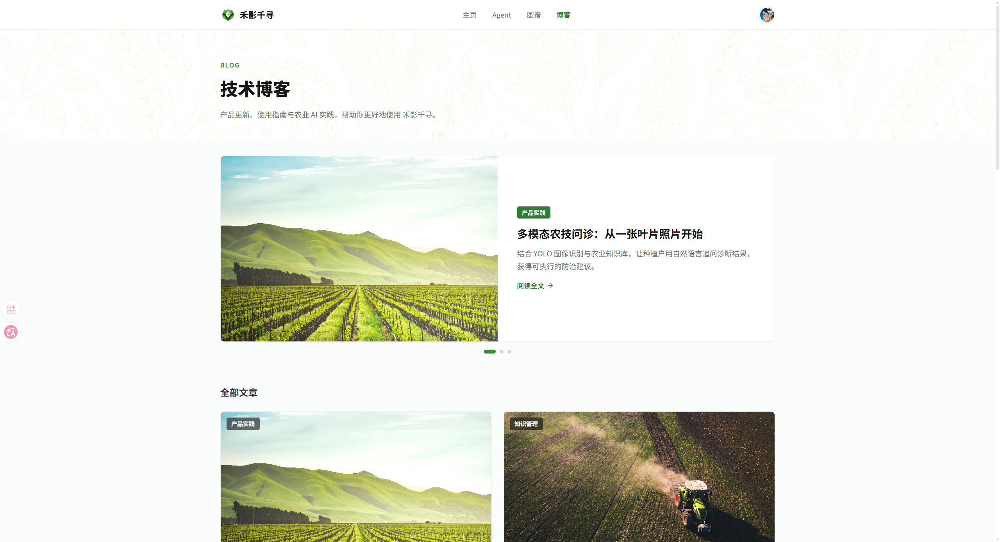
**功能**：
- 博客列表：展示文章卡片（配图、分类、日期、阅读时间、摘要）
- 特色文章轮播：突出展示精选文章
- 文章详情：Markdown 格式渲染，支持代码块、图片等富文本展示

博客数据目前为前端静态数据，文章内容以 Markdown 格式存储。


## 十五、角色与权限说明

| 角色 | 权限范围 |
|------|----------|
| **超级管理员** | 所有功能权限，包括系统设置、模型配置、邮箱配置、用户管理 |
| **管理员** | 除基础设置、模型配置、邮箱配置外的所有管理功能 |
| **普通用户** | Agent 对话、知识图谱查看、个人中心 |

### 管理员侧边导航
Agent → 知识图谱 → 知识库 → 数据面板 → 系统设置 → 农资管理 → 农作物字典 → Webhook

### 普通用户侧边导航
Agent → 个人中心 → 知识图谱


## 十六、AI Agent 架构说明

### 内置 Agent

| Agent 名称 | 类型 | 说明 |
|------------|------|------|
| 千寻问农 | ChatbotAgent | 通用农业问答 Agent，集成多种工具 |
| 千寻有方 | ChatbotAgent | 深度调查 Agent，自主制定计划并生成报告 |
| 推送消息助手 | WebhookAgent | 后台消息推送 Agent，不对外展示 |

### 工具系统

Agent 通过工具（Tool）与外部系统交互。当前可用的工具包括：

| 工具 | 功能 |
|------|------|
| 知识库检索 | RAG 检索，从关联知识库获取信息 |
| 知识图谱搜索 | 查询 Neo4j 图谱中的实体关系 |
| 联网搜索 | 通过 Tavily 获取最新网络信息 |
| YOLO 目标检测 | 识别作物图片中的病虫害 |
| 天气查询 | 查询实时天气与天气预报 |
| 药品查询 | 检索农业药品信息 |
| 计算器 | 数学表达式求值 |
| 附近农户 | 按地理位置查找附近用户 |


## 十七、部署指南

### 系统架构

禾影千寻采用微服务架构，通过 Docker Compose 编排，包含以下服务：

| 服务 | 容器名 | 端口 | 说明 |
|------|--------|------|------|
| **api** | qianxun-api-dev | 5050 | FastAPI 后端（Python 3.12），热重载开发模式 |
| **web** | qianxun-web-dev | 5173 | Vue 3 前端，热重载开发模式 |
| **postgres** | qianxun-postgres | 5432 | PostgreSQL 16，存储业务数据 |
| **graph** | qianxun-graph | 7474/7687 | Neo4j 5.26，知识图谱数据库 |
| **milvus** | qianxun-milvus | 19530/9091 | Milvus 向量数据库 v2.5.6 |
| **etcd** | qianxun-milvus-etcd | 2379 | Milvus 元数据存储 |
| **minio** | qianxun-milvus-minio | 9000/9001 | MinIO 对象存储（文件、图片） |
| **yoloapi** | qianxun-yolo-api | 8001 | YOLO 目标检测 API（Python 3.10） |
| **qianxun-server** | qianxun-server-01 | 8082 | Spring Boot 农资管理后端 |

以下服务需额外启用（通过 `--profile all`）：

| 服务 | 容器名 | 端口 | 说明 |
|------|--------|------|------|
| **mineru-vllm-server** | qianxun-mineru-vllm-server | 30000 | MinerU VLM 推理引擎（需 GPU） |
| **mineru-api** | qianxun-mineru-api | 30001 | MinerU 文档解析 API |
| **paddlex** | qianxun-paddlex-ocr | 8080 | PP-StructureV3 OCR 服务（需 GPU） |

### 环境要求

- Docker 和 Docker Compose v2
- Git
- 至少 8GB 可用内存（建议 16GB+）
- GPU（可选，仅 MinerU/PaddleX 需要）

### 快速部署

#### 1. 克隆项目

```bash
git clone <仓库地址> lingshi
cd lingshi
```

#### 2. 配置环境变量

复制环境变量模板并修改：

```bash
cp .env.template .env
```

关键配置项说明：

| 环境变量 | 必填 | 说明 |
|----------|------|------|
| `SILICONFLOW_API_KEY` | 推荐 | SiliconFlow API Key，用于 LLM 调用 |
| `DEEPSEEK_API_KEY` | 可选 | DeepSeek API Key |
| `TAVILY_API_KEY` | 可选 | Tavily 搜索 API Key，启用联网搜索 |
| `YOLO_API_URL` | 可选 | YOLO 服务地址（默认使用容器内地址） |
| `AMAP_KEY` | 可选 | 高德地图 API Key，用于地址定位 |
| `AMAP_SECURITY_JS_CODE` | 可选 | 高德地图安全密钥 |
| `CAIYUN_TOKEN` | 可选 | 彩云天气 API Token |
| `YUXI_SUPER_ADMIN_NAME` | 推荐 | 预置超级管理员用户名 |
| `YUXI_SUPER_ADMIN_PASSWORD` | 推荐 | 预置超级管理员密码 |
| `MINERU_API_KEY` | 可选 | MinerU 官方云 API Key |
| `WECHAT_APP_ID/SECRET` | 可选 | 微信公众号配置 |
| `SMTP_HOST/PORT/USER/PASSWORD` | 可选 | 邮件发送配置 |

#### 3. 启动服务

**基础启动（核心服务）**：
```bash
docker compose up -d
```

这会启动 api、web、postgres、neo4j、milvus、minio、yoloapi、qianxun-server 等基础服务。

**完整启动（含 OCR 服务）**：
```bash
docker compose --profile all up -d
```

这会额外启动 mineru-vllm-server、mineru-api、paddlex 等 GPU 加速服务。

#### 4. 访问系统

- **前端页面**：http://localhost:5173
- **后端 API**：http://localhost:5050/api/system/health
- **Neo4j 浏览器**：http://localhost:7474（默认账号 neo4j / 0123456789）
- **MinIO 管理台**：http://localhost:9001（默认账号 minioadmin / minioadmin）

#### 5. 初始化

首次访问前端页面会自动进入初始化界面，需要创建超级管理员账号。也可以在环境变量中预置 `YUXI_SUPER_ADMIN_NAME` 和 `YUXI_SUPER_ADMIN_PASSWORD`，系统启动时会自动初始化。

### 常用命令

```bash
# 查看运行状态
docker compose ps

# 查看后端日志
docker compose logs api --tail 100

# 查看前端日志
docker compose logs web --tail 100

# 重启某个服务
docker compose restart api

# 重新构建并启动（代码有较大变更时）
docker compose up -d --build api

# 停止所有服务
docker compose down

# 停止并删除数据卷（谨慎！会清空数据库）
docker compose down -v
```

### 生产部署

生产环境建议：

1. **前端构建**：使用 `docker compose --profile production up -d web` 或手动构建，生成静态文件通过 Nginx 部署
2. **反向代理**：使用 Nginx 反向代理 API 和前端，配置 HTTPS
3. **数据库**：PostgreSQL 和 Neo4j 建议使用外部实例或定期备份数据卷
4. **环境变量**：妥善保管 API Key 和密码，勿提交到版本控制
5. **资源限制**：在 docker-compose.yml 中为各服务配置资源限制

### 内网穿透（可选）

如需将本地服务暴露到公网（如微信公众号开发），可使用项目提供的 frp 脚本：
微信公众号强制 80 443 端口，开了一个服务器来转发
```bash
# 修改 scripts/install_frpc.sh 中的服务器地址后执行
bash scripts/install_frpc.sh
```


## 附录：常见问题

**Q: 如何切换 AI 模型？**
A: 管理员可在 Agent 配置中选择模型，或在"系统设置 → 模型配置"中添加自定义模型提供商。

**Q: 上传文件支持哪些格式？**
A: 支持 PDF、Word（doc/docx）、Excel（xls/xlsx）、PPT（pptx）、TXT、Markdown、HTML、JSON、CSV、图片（jpg/png/bmp/tiff）等格式，系统会自动解析处理。

**Q: 知识库文件如何变成可检索？**
A: 上传文件后需要经过"解析（Parse）→ 索引（Index）"两个阶段，完成后即可在对话中检索。可在文件列表中查看处理状态。

**Q: 如何将平台集成到外部系统？**
A: 可使用 Webhook 推送功能，通过 `POST /api/webhook/receive/{token}` 接口将消息推送到平台用户。

**Q: 忘记密码怎么办？**
A: 当前版本暂未开放自助找回密码功能，请联系管理员重置密码。

**Q: 为什么 OCR 解析失败？**
A: 检查对应 OCR 服务是否正常运行。RapidOCR 是本地离线引擎无需额外服务；MinerU 和 PaddleX 需要对应的 Docker 容器运行正常。

**Q: 如何配置邮箱？**
A: 超级管理员可在"系统设置 → 邮箱设置"中配置 SMTP 信息，或直接在 `.env` 文件中配置 `SMTP_*` 环境变量。

**Q: 如何开启内容审查？**
A: 超级管理员在"系统设置 → 基础设置"中启用"内容审查"开关，并配置审查使用的模型。